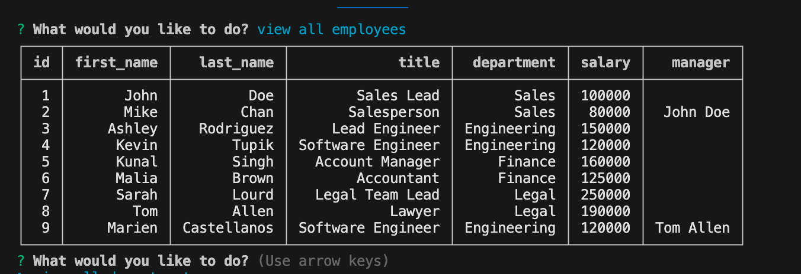

# Employee-Tracker
## Table of Contents
[Contact Me](#questions)
[Description](#description)
[Installation](#installation)
[Usage](#usage)
[License](#license)
[Test](#test)

## Description
    Its a made up database of employees with info such as salary manager role. 
## Installation
    You need to install console-table-printer, dotenv, inquirer, and mysql2.
## Usage
    You open up the terminal and run index.js. It will then prompt you options and you can go from there.

## Credits
    UM Coding Bootcamp, W3 schools.
## License
    This project is licensed under the MIT license.
## How to Contribute
    You can download the files and add onto it if you would like.
## Tests
    I ran a couple test but just to see if it is working.
## Questions
    https://github.com/mariencito
    You can email me at mariencastellanosjr@gmail.com
    